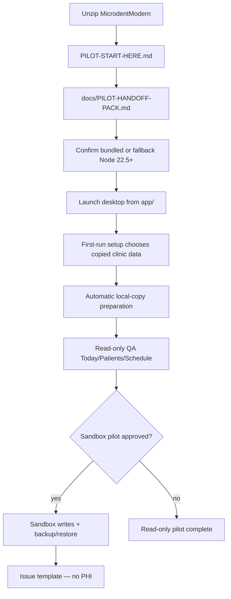

# Windows pilot handoff pack

**Purpose:** Single operator index for the staged `MicrodentModern/` package — from unzip through sandbox QA, restore, and feedback.

**Audience:** IT, clinic operators, pilot testers.

**Start here on clinic machines:** open **`PILOT-START-HERE.md`** at the package root, then this file in `docs/`.

**Quick index:** [PILOT-START-HERE.md](./PILOT-START-HERE.md) · [operator-manual.md](./operator-manual.md) · [support-knowledge-base.md](./support-knowledge-base.md) · [data-privacy-review.md](./data-privacy-review.md) · [windows-pilot-data-locations.md](./windows-pilot-data-locations.md) · [pilot-acceptance-checklist.md](./pilot-acceptance-checklist.md) · [pilot-issue-template.md](./pilot-issue-template.md)

---

## Pilot readiness status (three tiers)

| Tier | Question | Expected state (this release) |
| --- | --- | --- |
| **1. Mac-side release readiness** | Build machine can stage, verify, and pass strict signoff? | **READY** after `pnpm pilot:release-signoff` (Mac disposable sandbox env) |
| **2. Windows-test readiness** | Staged package includes field execution docs for IT/operators? | **READY** — section **0** below + [FIELD-TEST-START-HERE.md](./FIELD-TEST-START-HERE.md) |
| **3. Windows execution status** | Package verification evidence and Windows field evidence JSON filed? | **Deferred / Not yet run** |

**Clinic go-live:** **BLOCKED** until package verification evidence is validated, tier 3 is **Completed** with date and PHI-safe `qa-runs/` field evidence referencing `packageVerification.evidencePath`, and non-template commercial/go-live evidence records GO.

Mac checkpoint green ≠ clinic production. Schedule Windows testing when IT is ready; do not infer “run immediately” from Mac build success alone.

---

## 0 — Field test on Windows (real machine)

Use this index when a clinic PC runs the pilot — **after** you schedule a field test, not as an automatic follow-on to Mac signoff.

| Role | Doc | Use |
| --- | --- | --- |
| **Start** | [FIELD-TEST-START-HERE.md](./FIELD-TEST-START-HERE.md) | One-line pointer to field execution |
| **Scope** | [windows-pilot-release-notes.md](./windows-pilot-release-notes.md) | What works, caveats, unsupported features |
| **IT — verify** | [windows-pilot-package-verify-on-windows.md](./windows-pilot-package-verify-on-windows.md) + [windows-package-verify-evidence.md](./windows-package-verify-evidence.md) | Package check without pnpm, then filed package evidence before operators start |
| **Operator — daily use** | [operator-manual.md](./operator-manual.md) | First run, Today, Patients, Schedule, Settings, local copy, support logs |
| **Operator — how** | [windows-pilot-field-execution-script.md](./windows-pilot-field-execution-script.md) | Linear day-0 steps (EXEC-01 … EXEC-16) with pass criteria |
| **Operator — results** | [windows-pilot-field-result-form.md](./windows-pilot-field-result-form.md) | PHI-safe pass/fail capture |
| **Privacy** | [data-privacy-review.md](./data-privacy-review.md) | Local-only data handling and support boundaries |
| **Support** | [support-knowledge-base.md](./support-knowledge-base.md) | First-line triage, safe evidence, escalation levels |
| **Feedback triage** | [pilot-feedback-triage-workflow.md](./pilot-feedback-triage-workflow.md) | Daily pilot issue workflow and status vocabulary |
| **Sponsor — sign-off** | [windows-pilot-go-no-go-checklist.md](./windows-pilot-go-no-go-checklist.md) | GO / NO-GO decision table |
| **QA filing** | [TEMPLATE-windows-field-run.md](../qa-runs/TEMPLATE-windows-field-run.md) | Copy from staged `qa-runs/TEMPLATE-*` files into repo/internal tracker after the run |
| **Failures** | [windows-pilot-troubleshooting-pack.md](./windows-pilot-troubleshooting-pack.md) | Symptom → operator actions |
| **Paths / ACLs** | [windows-pilot-permission-and-path-risks.md](./windows-pilot-permission-and-path-risks.md) | Windows permission risks |
| **Matrix — what** | [windows-pilot-real-machine-checklist.md](./windows-pilot-real-machine-checklist.md) | Full field matrix (dev dry-run vs **Requires Windows PC**) |

**Rule:** Script = **how** to execute; checklist = **what** to prove. Record outcomes on the result form, not in patient-facing tools.

---

## What this package is / is not

| This **is** | This **is not** |
| --- | --- |
| A portable Windows pilot handoff (compiled app, bridge, web UI) | An NSIS/MSI installer or signed auto-update product |
| Read-only clinic viewer over a copied sandbox DATA + SQLite mirror | Production write access to live Microdent-Legacy |
| Four sandbox write workflows when IT explicitly enables them | Payments, ledger, chart, medical summary, or memo writes |
| Desktop first-run setup that prepares the local copy automatically | Write-mode toggle for production data |
| Hash-verified `RELEASE-MANIFEST.json` for IT integrity checks | Clinic DBF, sqlite, backups, logs, or `.env` secrets in the zip |

**Unsupported in this pilot RC** (also listed in `RELEASE-MANIFEST.json` → `unsupportedFeatures`): payments, ledger writes, chart writes, installer, auto-update.

Installer path forward: [windows-pilot-installer-decision-record.md](./windows-pilot-installer-decision-record.md).

---

## Launch flow (operator)

**Safety warnings:** Never choose a live legacy folder as the clinic data folder. Keep local copy, backups, logs, and clinic data outside the install folder. Do not attach patient data to support tickets — use [pilot-issue-template.md](./pilot-issue-template.md).

---

## 1 — Open / unzip the package

| Step | Action |
| --- | --- |
| 1.1 | IT copies `MicrodentModern/` from the build machine zip to a local drive (example: `C:\Microdent\MicrodentModern\`) |
| 1.2 | Confirm `HANDOFF-README.txt` and `RELEASE-MANIFEST.json` are present at the package root |
| 1.3 | Do **not** store clinic data, local-copy files, backups, or logs inside the install folder |

Build-machine verification (not on clinic PCs): `pnpm pilot:verify-release` and `pnpm pilot:verify-manifest`.

Layout reference: [windows-pilot-release-layout.md](./windows-pilot-release-layout.md).

---

## 2 — First launch

| Step | Action | Detail |
| --- | --- | --- |
| 2.1 | Confirm bundled or fallback **Node.js 22.5+** | Preferred: `node\RUNTIME-MANIFEST.json`; fallback: Node on PATH / `MICRODENT_NODE_BINARY` |
| 2.2 | Launch the portable smoke runner from the package root | Double-click `DOUBLE-CLICK-WINDOWS-TEST.cmd`; it opens the packaged `.exe` when present or the local web preview fallback |
| 2.3 | Complete **first-run setup** when prompted | Choose copied clinic data folder; local copy is prepared automatically |
| 2.4 | Config saves to `%AppData%\Microdent\config.json` | Open via Win+R → `%AppData%\Microdent` |

Real-Windows field execution: [windows-pilot-field-execution-script.md](./windows-pilot-field-execution-script.md). Matrix: [windows-pilot-real-machine-checklist.md](./windows-pilot-real-machine-checklist.md). Results: [windows-pilot-field-result-form.md](./windows-pilot-field-result-form.md).

---

## 3 — Folder selection (setup)

| Setting | Role | Windows example (sandbox) |
| --- | --- | --- |
| **Clinic data folder** | Disposable copied DBF tree | `C:\ClinicData\Microdent\DATA` |
| **Local copy** | Derived by setup for search/schedule | `C:\ClinicData\Microdent\mirror\clinic.sqlite` |
| **Backups** | Derived by setup; required before sandbox commits | `C:\ClinicData\Microdent\microdent-backups` |

**Hard rules:**

- Never choose live **Microdent-Legacy** as the clinic data folder.
- Local copy, backups, logs, and clinic data must stay **outside** the install folder.
- Quote paths with spaces in PowerShell (e.g. `"C:\Clinic Data\Pilot Sandbox\DATA"`).
- UNC shares are warn-only — prefer local drive letters when IT allows.

Full reference: [windows-pilot-data-locations.md](./windows-pilot-data-locations.md).

---

## 4 — Local copy preparation

| Step | Action |
| --- | --- |
| 4.1 | First-run setup prepares the local copy automatically after the copied clinic data folder is chosen |
| 4.2 | Open **Settings → Local copy & import** and tap **Refresh status** |
| 4.3 | If stale or empty, tap **Refresh local copy** |
| 4.4 | Copied clinic files stay the write source of truth — local copy is a snapshot |

Support fallback pointer in package: `scripts/mirror-import-pointer.txt`.

---

## 5 — Read-only QA

Before any sandbox writes:

| Area | Check |
| --- | --- |
| **Today** | Day list loads; no patient notes/phones in UI |
| **Patients** | Search by chart or name fragment; privacy lede visible |
| **Schedule** | Week/day navigation; read-only banner |
| **Settings** | Pilot readiness checklist — bridge connected, mirror status understood |

`writeMode` stays **disabled** until sandbox pilot is explicitly approved.

Runbook: [phase-5-operator-qa-runbook.md](./phase-5-operator-qa-runbook.md).

---

## 6 — Sandbox QA (optional pilot)

Only on a **disposable Write-Sandbox** with IT present:

| Step | Action |
| --- | --- |
| 6.1 | Configure `BACKUP_DIR` before first commit |
| 6.2 | Enable write mode per [phase-7-sandbox-pilot-qa-runbook.md](./phase-7-sandbox-pilot-qa-runbook.md) |
| 6.3 | Exercise four workflows only — status, time move, create, demographics |
| 6.4 | Capture `operationId` and backup/audit lines from write feedback — no PHI |

Automated proof (build/dev machine with sandbox env): `pnpm qa:sandbox`.

Guardrails: [out-of-scope-guardrails.md](./out-of-scope-guardrails.md).

---

## 7 — Restore and recovery

| Step | Action |
| --- | --- |
| 7.1 | After commits, note **operation id** and backup line in write feedback |
| 7.2 | Verify backups: `pnpm --filter @microdent/bridge run legacy-backup-verify` |
| 7.3 | Restore on **sandbox DATA only**: `pnpm --filter @microdent/bridge run legacy-restore` |
| 7.4 | Use **Settings → Refresh local copy** if search/schedule must match copied files again |

Full guide: [pilot-backup-restore-audit.md](./pilot-backup-restore-audit.md).

---

## 8 — Unsupported in this pilot RC

- NSIS/MSI installer, code signing, auto-update
- Production write-mode toggle
- Payments, ledger, chart, medical summary, or memo writes
- Pointing the clinic data folder at production legacy

See [out-of-scope-guardrails.md](./out-of-scope-guardrails.md) and [windows-pilot-packaging-gap-report.md](./windows-pilot-packaging-gap-report.md).

---

## 9 — Troubleshooting

| Symptom | What to check |
| --- | --- |
| Clinic service offline | Desktop config paths; Settings **Check service port**; bundled or fallback Node 22.5+ |
| Blank UI | Web dist missing from package — rebuild on build machine |
| Local copy stale | Settings **Refresh local copy**; copied clinic files stay source of truth |
| Write blocked | Sandbox marker, `writeMode`, backup folder — phase-7 runbook |
| SmartScreen warning | Expected for unsigned Electron until code signing |

More: [windows-pilot-troubleshooting-pack.md](./windows-pilot-troubleshooting-pack.md) · [PILOT-START-HERE.md § Troubleshooting](./PILOT-START-HERE.md#troubleshooting)

---

## 10 — Feedback (no PHI)

Use **[pilot-issue-template.md](./pilot-issue-template.md)** — copy fields into your internal tracker.

| Include | Do not attach |
| --- | --- |
| `packageVersion` from `RELEASE-MANIFEST.json` | DBF files or sqlite |
| Checklist section / screen name | Patient names or phones |
| `operationId` for write issues | Full config paths in public tickets |

IT sign-off: [pilot-acceptance-checklist.md](./pilot-acceptance-checklist.md).

Pilot support workflow:

- First-line support: [support-knowledge-base.md](./support-knowledge-base.md)
- Triage loop and status vocabulary: [pilot-feedback-triage-workflow.md](./pilot-feedback-triage-workflow.md)
- Support readiness evidence: [support-readiness-checklist.md](./support-readiness-checklist.md)

---

## Related docs in this package

| Doc | Use when |
| --- | --- |
| [FIELD-TEST-START-HERE.md](./FIELD-TEST-START-HERE.md) | Field test entry point |
| [operator-manual.md](./operator-manual.md) | Day-to-day operator workflow and troubleshooting |
| [data-privacy-review.md](./data-privacy-review.md) | Local-only PHI handling and support boundaries |
| [support-knowledge-base.md](./support-knowledge-base.md) | First-line support playbook |
| [pilot-feedback-triage-workflow.md](./pilot-feedback-triage-workflow.md) | Feedback triage and issue workflow |
| [support-readiness-checklist.md](./support-readiness-checklist.md) | Evidence checklist for support readiness |
| [licensing-readiness.md](./licensing-readiness.md) | Offline/no-PHI licensing readiness |
| [distribution-readiness.md](./distribution-readiness.md) | Distribution channel and marketing-claim readiness |
| [pricing-readiness.md](./pricing-readiness.md) | Pricing model readiness without telemetry dependency |
| [marketing-readiness.md](./marketing-readiness.md) | Marketing/public-claim readiness |
| [windows-pilot-release-notes.md](./windows-pilot-release-notes.md) | Pilot scope and caveats |
| [windows-pilot-troubleshooting-pack.md](./windows-pilot-troubleshooting-pack.md) | Windows field failures — bridge, AV, mirror, restore |
| [windows-pilot-package-verify-on-windows.md](./windows-pilot-package-verify-on-windows.md) | IT verify package on Windows without pnpm |
| [windows-package-verify-evidence.md](./windows-package-verify-evidence.md) | Machine-readable package verification evidence required before field execution |
| [evidence-attachment-manifest.md](./evidence-attachment-manifest.md) | Redacted attachment metadata for package and field evidence |
| [windows-field-evidence-report.md](./windows-field-evidence-report.md) | Machine-readable Windows field evidence tied to package verification |
| [windows-pilot-go-no-go-checklist.md](./windows-pilot-go-no-go-checklist.md) | Sponsor sign-off after validated package verification and filed Windows field evidence |
| [windows-pilot-permission-and-path-risks.md](./windows-pilot-permission-and-path-risks.md) | Drive letters, ACLs, AV, UNC |
| [pilot-tester-guide.md](./pilot-tester-guide.md) | Guided day 1–3 script |
| [windows-pilot-field-execution-script.md](./windows-pilot-field-execution-script.md) | Linear field test steps (how) |
| [windows-pilot-field-result-form.md](./windows-pilot-field-result-form.md) | PHI-safe field results (what was observed) |
| [windows-compatibility-evidence.md](./windows-compatibility-evidence.md) | Windows 10/11 and antivirus/endpoint matrix evidence |
| [windows-pilot-real-machine-checklist.md](./windows-pilot-real-machine-checklist.md) | Field test matrix (what to prove; dev vs Windows PC) |
| [pilot-issue-template.md](./pilot-issue-template.md) | Safe issue reporting (no PHI) |
| [windows-pilot-installer-decision-record.md](./windows-pilot-installer-decision-record.md) | Portable vs installer next phase |
| [installer-deferral-decision-record.md](./installer-deferral-decision-record.md) | Concise installer deferral record |
| [code-signing-deferral-decision-record.md](./code-signing-deferral-decision-record.md) | Code signing blocker record |
| [auto-update-deferral-decision-record.md](./auto-update-deferral-decision-record.md) | Auto-update blocker record |
| [telemetry-deferral-decision-record.md](./telemetry-deferral-decision-record.md) | Telemetry/upload deferral record |
| [external-field-blockers-decision-record.md](./external-field-blockers-decision-record.md) | External Windows field blockers |
| [pilot-backup-restore-audit.md](./pilot-backup-restore-audit.md) | Backup/restore + UI feedback |
| [windows-pilot-data-locations.md](./windows-pilot-data-locations.md) | Install vs AppData vs clinic paths |
