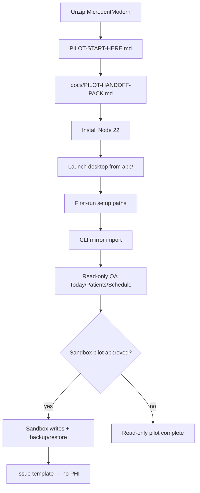

# Windows pilot handoff pack

**Purpose:** Single operator index for the staged `MicrodentModern/` package — from unzip through sandbox QA, restore, and feedback.

**Audience:** IT, clinic operators, pilot testers.

**Start here on clinic machines:** open **`PILOT-START-HERE.md`** at the package root, then this file in `docs/`.

**Quick index:** [PILOT-START-HERE.md](./PILOT-START-HERE.md) · [windows-pilot-data-locations.md](./windows-pilot-data-locations.md) · [pilot-acceptance-checklist.md](./pilot-acceptance-checklist.md) · [pilot-issue-template.md](./pilot-issue-template.md)

---

## What this package is / is not

| This **is** | This **is not** |
| --- | --- |
| A portable Windows pilot handoff (compiled app, bridge, web UI) | An NSIS/MSI installer or signed auto-update product |
| Read-only clinic viewer over a copied sandbox DATA + SQLite mirror | Production write access to live Microdent-Legacy |
| Four sandbox write workflows when IT explicitly enables them | Payments, ledger, chart, medical summary, or memo writes |
| CLI mirror import + desktop setup for paths | In-app mirror import or write-mode toggle |
| Hash-verified `RELEASE-MANIFEST.json` for IT integrity checks | Clinic DBF, sqlite, backups, logs, or `.env` secrets in the zip |

**Unsupported in this pilot RC** (also listed in `RELEASE-MANIFEST.json` → `unsupportedFeatures`): payments, ledger writes, chart writes, in-app mirror import, installer.

Installer path forward: [windows-pilot-installer-decision-record.md](./windows-pilot-installer-decision-record.md).

---

## Launch flow (operator)

**Safety warnings:** Never point DATA_ROOT at live legacy. Keep mirror, backups, and DATA outside the install folder. Do not attach patient data to support tickets — use [pilot-issue-template.md](./pilot-issue-template.md).

---

## 1 — Open / unzip the package

| Step | Action |
| --- | --- |
| 1.1 | IT copies `MicrodentModern/` from the build machine zip to a local drive (example: `C:\Microdent\MicrodentModern\`) |
| 1.2 | Confirm `HANDOFF-README.txt` and `RELEASE-MANIFEST.json` are present at the package root |
| 1.3 | Do **not** store DATA_ROOT, mirror SQLite, backups, or logs inside the install folder |

Build-machine verification (not on clinic PCs): `pnpm pilot:verify-release` and `pnpm pilot:verify-manifest`.

Layout reference: [windows-pilot-release-layout.md](./windows-pilot-release-layout.md).

---

## 2 — First launch

| Step | Action | Detail |
| --- | --- | --- |
| 2.1 | Install **Node.js 22.x** on PATH | Required for the bridge child process |
| 2.2 | Launch the desktop shell from `app/` | See `HANDOFF-README.txt` — Electron + system Node |
| 2.3 | Complete **first-run setup** when prompted | Absolute paths only; synthetic examples in setup window |
| 2.4 | Config saves to `%AppData%\Microdent\config.json` | Open via Win+R → `%AppData%\Microdent` |

Real-Windows field checks: [windows-pilot-real-machine-checklist.md](./windows-pilot-real-machine-checklist.md).

---

## 3 — Folder selection (setup)

| Setting | Role | Windows example (sandbox) |
| --- | --- | --- |
| **DATA_ROOT** | Disposable Write-Sandbox DBF tree | `C:\ClinicData\Microdent\DATA` |
| **SQLITE_PATH** | Mirror for search/schedule | `C:\Users\Public\MicrodentModern\mirror\clinic.sqlite` |
| **BACKUP_DIR** | Required before sandbox commits | `C:\Users\Public\MicrodentModern\backups` |

**Hard rules:**

- Never point DATA_ROOT at live **Microdent-Legacy**.
- Mirror, backups, and DATA_ROOT must stay **outside** the install folder.
- Quote paths with spaces in PowerShell (e.g. `"C:\Clinic Data\Pilot Sandbox\DATA"`).
- UNC shares are warn-only — prefer local drive letters when IT allows.

Full reference: [windows-pilot-data-locations.md](./windows-pilot-data-locations.md).

---

## 4 — Mirror import (CLI only)

| Step | Action |
| --- | --- |
| 4.1 | Set `DATA_ROOT` and `SQLITE_PATH` in PowerShell (see `config-templates/paths.example.env`) |
| 4.2 | Run safe import from a repo checkout or follow [phase-4-mirror-import-operator.md](./phase-4-mirror-import-operator.md) |
| 4.3 | Open **Settings → Mirror import** and tap **Refresh status** |
| 4.4 | DBF is the write source of truth — SQLite is a snapshot |

Pointer in package: `scripts/mirror-import-pointer.txt`.

---

## 5 — Read-only QA

Before any sandbox writes:

| Area | Check |
| --- | --- |
| **Today** | Day list loads; no patient notes/phones in UI |
| **Patients** | Search by chart or name fragment; privacy lede visible |
| **Schedule** | Week/day navigation; read-only banner |
| **Settings** | Pilot readiness checklist — bridge connected, mirror status understood |

`writeMode` stays **disabled** until sandbox pilot is explicitly approved.

Runbook: [phase-5-operator-qa-runbook.md](./phase-5-operator-qa-runbook.md).

---

## 6 — Sandbox QA (optional pilot)

Only on a **disposable Write-Sandbox** with IT present:

| Step | Action |
| --- | --- |
| 6.1 | Configure `BACKUP_DIR` before first commit |
| 6.2 | Enable write mode per [phase-7-sandbox-pilot-qa-runbook.md](./phase-7-sandbox-pilot-qa-runbook.md) |
| 6.3 | Exercise four workflows only — status, time move, create, demographics |
| 6.4 | Capture `operationId` and backup/audit lines from write feedback — no PHI |

Automated proof (build/dev machine with sandbox env): `pnpm qa:sandbox`.

Guardrails: [out-of-scope-guardrails.md](./out-of-scope-guardrails.md).

---

## 7 — Restore and recovery

| Step | Action |
| --- | --- |
| 7.1 | After commits, note **operation id** and backup line in write feedback |
| 7.2 | Verify backups: `pnpm --filter @microdent/bridge run legacy-backup-verify` |
| 7.3 | Restore on **sandbox DATA only**: `pnpm --filter @microdent/bridge run legacy-restore` |
| 7.4 | Re-run mirror import if search/schedule must match DBF again |

Full guide: [pilot-backup-restore-audit.md](./pilot-backup-restore-audit.md).

---

## 8 — Unsupported in this pilot RC

- NSIS/MSI installer, code signing, auto-update
- In-app mirror import or write-mode toggle
- Payments, ledger, chart, medical summary, or memo writes
- Pointing DATA_ROOT at production legacy

See [out-of-scope-guardrails.md](./out-of-scope-guardrails.md) and [windows-pilot-packaging-gap-report.md](./windows-pilot-packaging-gap-report.md).

---

## 9 — Troubleshooting

| Symptom | What to check |
| --- | --- |
| Bridge offline | Desktop config paths; port **17890** free; Node 22 on PATH |
| Blank UI | Web dist missing from package — rebuild on build machine |
| Mirror stale | Re-run safe mirror import; DBF stays source of truth |
| Write blocked | Sandbox marker, `writeMode`, backup folder — phase-7 runbook |
| SmartScreen warning | Expected for unsigned Electron until code signing |

More: [PILOT-START-HERE.md § Troubleshooting](./PILOT-START-HERE.md#troubleshooting).

---

## 10 — Feedback (no PHI)

Use **[pilot-issue-template.md](./pilot-issue-template.md)** — copy fields into your internal tracker.

| Include | Do not attach |
| --- | --- |
| `packageVersion` from `RELEASE-MANIFEST.json` | DBF files or sqlite |
| Checklist section / screen name | Patient names or phones |
| `operationId` for write issues | Full config paths in public tickets |

IT sign-off: [pilot-acceptance-checklist.md](./pilot-acceptance-checklist.md).

---

## Related docs in this package

| Doc | Use when |
| --- | --- |
| [PILOT-START-HERE.md](./PILOT-START-HERE.md) | One-page index and validation commands |
| [pilot-tester-guide.md](./pilot-tester-guide.md) | Guided day 1–3 script |
| [windows-pilot-real-machine-checklist.md](./windows-pilot-real-machine-checklist.md) | Field test matrix (dev vs Windows PC) |
| [pilot-issue-template.md](./pilot-issue-template.md) | Safe issue reporting (no PHI) |
| [windows-pilot-installer-decision-record.md](./windows-pilot-installer-decision-record.md) | Portable vs installer next phase |
| [pilot-backup-restore-audit.md](./pilot-backup-restore-audit.md) | Backup/restore + UI feedback |
| [windows-pilot-data-locations.md](./windows-pilot-data-locations.md) | Install vs AppData vs clinic paths |
