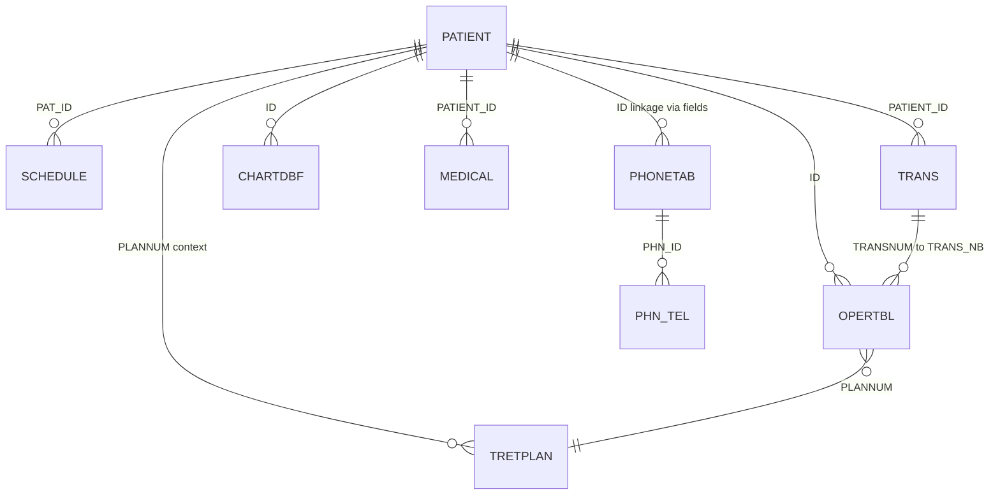

# Microdent Legacy System Map

This document summarizes the **Microdent** legacy dental practice management stack as observed under the read-only copy:

`/Users/Tamam/Desktop/Microdent/Microdent-Legacy`

**Analysis date:** 2026-05-14  

**Scope:** Folders, executables (names only; **no EXEs were run**), configuration snippets, FoxPro/Visual FoxPro data files under `DATA`, and the delivered **64-bit scheduler replacement** (`schedule_replacement.py`).  

**Methodology:** Directory listing, `strings` on one `.DBC` container, and a **read-only** Python 3 script (stdlib only) that parsed DBF headers and counted active vs deleted records. The script opened legacy files in binary read mode and did not write to the legacy tree.

**Product/version hint:** `DATA/VERSION.INI` reports release **7.03** (dated SEP 18, 2002 in that file). `CONFIG.FPW` references Visual FoxPro startup (`do HOME() +"vfpstart"`). Many DBFs use header version `0xF5` (Visual FoxPro with null flags).

---

## 1. Top-level layout (legacy install root)

| Area | Role |
|------|------|
| **`DATA/`** | Primary live FoxPro/VFP tables, indexes (`.CDX`), memo files (`.FPT`), database containers (`.DBC`/`.DCT`/`.DCX`), Crystal/HLP assets, small `.DAT` clinical helpers. |
| **`DATA old/`** | Parallel copy of the `DATA` tree (same scale; treat as backup/snapshot, not authoritative without verification). |
| **`DATA ORIG/`** | Older/original payload; fewer total companion files than `DATA` in this copy but still contains full schemas (e.g. `PATIENT.DBF`, `SCHEDULE.DBF`, reports). |
| **`NETSENT4/`** | Sentinel HASP / network licensing kit (`NSSRVICE.EXE`, DLLs, docs). Implies **dongle or network license** constraints for multi-workstation use. |
| **`ART/`, `COM_ARB/`, `COM_REP/`, `DEN_ARB/`, `DEN_REP/`** | Report and art assets (Arabic/French naming suggests localized reporting). |
| **`TEMP/`, `VIDEO/`, `UDF/`** | Scratch/version stubs for sub-features. |
| **Root `*.EXE`** | Suite of 16-bit VB3/VB4 and 32-bit helpers: scheduling, charting, video, perio, nerves, billing-related tools, `REINDEX.EXE`, `PACK.EXE`, `UPGRADE.EXE`, main shell **`MICROT.EXE`** (large), **`PREMA.EXE`**, **`GDDENT.EXE`**, etc. **Not executed** during this analysis. |
| **`MICRODEN.INI`** | ODBC / ISAM hints (FoxPro 2.5 ISAM), `[Rooms]` / `[Weeks]` column widths, `program=MICRODENT`. |
| **`README_SCHEDULER_FIX.txt`**, **`schedule_replacement.py`**, **`BUILD_SCHEDULE_EXE.bat`** | Documents replacing **16-bit `SCHEDULE.EXE`** with a Python-based 64-bit build that reads/writes the same **`SCHEDULE.DBF`**. |

---

## 2. DBF / CDX / FPT / DBC inventory (`DATA/`)

Approximate counts under **`Microdent-Legacy/DATA`** (this copy):

| Extension | Approx. count | Notes |
|-----------|----------------|--------|
| **`.DBF`** | 243 files | 235 parsed cleanly as DBF headers; **8 failed** header parse (see risks). |
| **`.CDX`** | 82 | Structural indexes; must stay in sync with DBF layouts. |
| **`.FPT`** | 69 | Memo tables; **high integrity coupling** to parent DBF basenames. |
| **`.DBC`** | 5 | Visual FoxPro **database containers** (e.g. `ACCOUNTS`, `OPERAT`, `PATIENT` domains). |

**Convention:** For each table `FOO.DBF` with memo fields, expect `FOO.FPT` and usually `FOO.CDX`. Corruption or manual copy of DBF without matching FPT/CDX is a common failure mode.

---

## 3. Core tables, record counts, and fields

Counts below are **active (non–deleted-flag) rows** vs **soft-deleted** rows from `DATA/` on the legacy copy, unless noted.

### 3.1 Patient identity and demographics

| Table | Active | Deleted | Purpose / notes |
|-------|--------|---------|------------------|
| **`PATIENT.DBF`** | 18,345 | 2 | Master patient record; **80 fields** including demographics, phones, employer, insurance ids, `ENTRY_DATE`, `LASTVISIT`, `ACTIVE`, memos `PAT_M_COMP`, `QUICKNOTE`. Key **`ID`** (N 10). |
| **`_patshet.DBF`** | 7,207 | 0 | Scheduler-oriented patient subset; schema parallels `PATIENT` with smaller memo block sizes (`M` 4 vs 10). Used by **`schedule_replacement.py`** for search when present. |
| **`PAT1.DBF`** | 18,331 | 2 | Secondary patient list: `ID`, `NAME`, `CASENB`, phones, `DOCTOR_NB`, `HOUSEHOLD`, etc. Likely **index-optimized or join helper** for lookups. |
| **`NEWPAT.DBF`** | 2 | 0 | Staging / intake (81 fields, overlaps `PATIENT`). |
| **`PHONETAB.DBF`** | 21,984 | 2 | Phone book / directory rows with `PHN_ID`, doctor link, `NOTE` memo. |
| **`PHN_TEL.DBF`** | 159,273 | 6 | Individual telephone lines keyed by `PHN_ID`, `TEL`, `DISCRIB`, `REGION`, `_NullFlags`. |
| **`MEDICAL.DBF`** | 2,619 | 0 | Medical history questionnaire per `PATIENT_ID`, `DATE`, many Y/N flags, `PROBLEM`, memos. |
| **`PAT_INS.DBF`** | 3 | 0 | Wide insurance profile (primary/secondary/tertiary blocks, accident/ortho flags, signatures). **`PATIENT_ID` not in first slice**—linkage likely by convention or additional fields later in table; confirm in migration. |
| **`HISTORY.DBF`** | 204 | 0 | Lightweight log: `NAME`, `ID`, `DATE`, `TIME`, `DOCTOR_NB` (legacy dBase III style `C` date/time fields). |

**Likely relationships:** `PATIENT.ID` joins `SCHEDULE.PAT_ID`, `TRANS.PATIENT_ID`, `CHARTDBF.ID`, `OPERTBL.ID`, `MEDICAL.PATIENT_ID`, `TRETPLAN` via `PLANNUM` / patient context, `PHONETAB.ID` / `PHN_TEL.PHN_ID` as phone graph.

### 3.2 Scheduling and appointments

| Table | Active | Deleted | Purpose / notes |
|-------|--------|---------|------------------|
| **`SCHEDULE.DBF`** | 181,297 | 0 | **Canonical appointment store** for the scheduler. Fields: `ID`, `DATE`, `TIME`, `DURATION`, `ROOM`, `COMMENT` (M), `PROC_CLASS`, `PAT_ID`, `PAT_NAME`, `DOC_ID`, `PERIOD`, `TELEPHONE`, `STATUS`, `CASENUM`, `VAC_ID`, `RECALL`, `UNREASON`, `MISSED`. |
| **`SC_ROOM.DBF`** | 25 | 0 | Room grid: `ROOM`, `DAY1`–`DAY7` (L), `DOCT`. Drives which rooms/days are active. |
| **`DICSCHED.DBF`** | 2 | 0 | Large **UI string / label dictionary** for scheduler (room captions `ROOM1`–`ROOM25`, menu text, warnings). Not transactional patient data. |
| **`APPOINT.DBF`** | 1 | 0 | Tiny dBase-style table; likely **template or legacy**; not the main schedule. |

**`schedule_replacement.py` (64-bit scheduler)** confirms operational expectations:

- Primary file: **`SCHEDULE.DBF`**.
- Patient search: **`_patshet.DBF`**, else **`PATIENT.DBF`**.
- Rooms: **`SC_ROOM.DBF`** + optional room labels from **`DICSCHED.DBF`**.
- Status codes used in UI: `0` Available … `5` No-show.
- New appointments set defaults: `VAC_ID=0`, `RECALL=0`, `UNREASON=0`, `MISSED=.F.`, `PROC_CLASS=0`, `DOC_ID=0`, `CASENUM=''`, `PERIOD=30`.

### 3.3 Clinical chart (odontogram-style)

| Table | Active | Deleted | Purpose / notes |
|-------|--------|---------|------------------|
| **`CHARTDBF.DBF`** | 868,361 | 104 | **Per-patient, per-tooth** state. **`ID`** = patient key, **`TOOTHNB`** = tooth number, **`TYPE`** = chart type, many `*_S` / `*_C` surface and status flags, `NOTE` memo, `TREATED`, `USER_S`, etc. **67 fields** (full list in appendix A). |
| **`CHARTFLG.DBF`** | 26,797 | 2 | `PATIENT_ID` + `FLAG_C` — patient-level chart flags. |
| **`CHARTTMP.DBF`** | 424 | 0 | Temp chart mirror of `CHARTDBF` structure. |

### 3.4 Treatment procedures (production table)

| Table | Active | Deleted | Purpose / notes |
|-------|--------|---------|------------------|
| **`OPERTBL.DBF`** | 416,459 | 4,451 | **Procedure lines**: `ID` (patient), `OPNUM`, `TOOTHNB`, `PROCEDURE`, `SUBPROC`, `CLASSIF`, `DATE`, **`TRANSNUM`** (ties to ledger), fees (`FEE_INIT`, `FEE`, `CHARGE`, `PROFIT`, `COST`), `STATUS`, `PROCNB`, `SURFACE`, `QUANTITY`, `PLANNUM`, `DOCT`, memo `DESCRIPT`, discounts, null flags. |
| **`PROCINIT.DBF`**, **`PROCJADA.DBF`**, **`PROCENTR.DBF`**, **`TAB1.DBF`** | Various | 0 | Procedure dictionaries / price lists / JADA coding variants. |
| **`TRETPLAN.DBF`** | 56,032 | 24 | **Treatment plan / insurance financial** lines: `PLANNUM`, `DEBIT`, `INS_PAY`, `TOT_PAY`, `INSCOMP`, `INSPLAN`, `INSURED`, `NOTE` memo, `CLAIMNUM`, copay fields. |

**Likely relationships:** `OPERTBL.TRANSNUM` → `TRANS.TRANS_NB`; `OPERTBL.ID` / `CHARTDBF.ID` → `PATIENT.ID`; `OPERTBL.PLANNUM` / `TRETPLAN.PLANNUM` connect clinical production to plan accounting.

### 3.5 Ledger, payments, adjustments

| Table | Active | Deleted | Purpose / notes |
|-------|--------|---------|------------------|
| **`TRANS.DBF`** | 343,530 | 468 | **General ledger / billing lines** per patient: `PATIENT_ID`, `AMOUNT`, `DATE`, `CARD`, `TRANS_NB`, `MONTH`, `YEAR`, `DESCR` (M), `SAMOUNT`, `CH_TYPE`, `ADJ_TYPE`, `PAY_TYPE`, `PLANNUM`, `DOCT`, `INSPAYNO`, `QUANTITY`. |
| **`_transto.DBF`** | 156,466 | 0 | Secondary transfer/shadow of transactions (`TRANS_NB`, `TR_TYPE`, `PAY_TYPE`, memos). Likely reporting or day-end pipeline. |

**Practice accounting (separate DBC):**

| Table | Active | Notes |
|-------|--------|-------|
| **`ACCOUNTS.DBF`** | 2 | GL-style accounts; currency fields `Y` type; memo `NOTES`. |
| **`ACCTRAN.DBF`** | 2 | Bank-style splits: `DEBIT`, `CREDIT`, `AMOUNT`, categories, transfer flags. |

Other payment-related tables present with low volume in this copy: **`INSMDPAY.DBF`** (insurance payments, 0 rows here), **`EXPENSED.DBF`** (expenses, 4 rows), **`ADJUST.DBF`** (parse failure; see risks).

### 3.6 System counters and metadata

| Table | Active | Notes |
|-------|--------|-------|
| **`IDS.DBF`** | 1 | **Singleton counter row** tracking max ids for `TRANS`, `OPER`, appointments, plans, drugs, users, etc. Critical for **ID allocation integrity**. |

| Table | Active | Notes |
|-------|--------|-------|
| **`DBFS.DBF`** | 140 | **Runtime table registry**: `TABLE`, `OPEN`, `EXCLUSIVE`, `CONDITION`, `RES_TYPE`, `PACKAGE`, `LOCAL`. Documents which DBFs the app expects to open together. |

### 3.7 Other notable modules (selected)

- **`VIDEO.DBF`**: Imaging metadata (`PATIENT_ID`, filenames, `NOTE` memo).  
- **`PERIOCH.DBF`**, **`ORTHO.DBF`**, **`OCCLUSIO.DBF`**: Specialty clinical modules (perio chart, ortho, occlusion) with memos.  
- **`PR_HEAD.DBF` / `PR_ENTRY.DBF`**: Prescription header/lines (`PRE_ID`, drug, dose, `DUSAGE` memo).  
- **`RA_HEAD.DBF` / `RA_ENTRY.DBF`**: Empty in this copy. `RA_HEAD` includes fields such as `PHYSICIAN`, `ROOM`, `BED`, `HIST_NOTE` (memos), while `RA_ENTRY` resembles medication lines (`PRE_ID`, `DRUG_NUM`, `DUSAGE` memo). Treat naming as **ambiguous** until confirmed in the live app (could be hospital pre-admission, anesthetic record, or a parallel prescription module).  
- **`RECALL.DBF`**: Empty in this copy; schema suggests recall scheduling (`PATIENT_ID`, `DATE`, `RECALL_ON`, `STATUS`, `PROCEDURE`).  
- **`ECF*.DBF`**: Electronic claim form line items (`ECF4` has rows); ties to insurance billing.  
- **`QM_*`, `UDF*`**: Query manager / user-defined field metadata.  

---

## 4. Likely entity relationships (conceptual ER)

**Caveats:** FoxPro often relies on **naming convention** and application logic rather than enforced FKs. Numeric `ID` widths differ (`N6` vs `N10`) between some tables—joins may cast or pad in app code. **`PAT_INS`** linkage to `PATIENT` needs validation against live rules.

---

## 5. Workflows (inferred from schema + scheduler script)

### 5.1 Patient workflow

1. **Registration / edit:** `PATIENT.DBF` (possibly staged via `NEWPAT.DBF`).  
2. **Duplicate / search optimization:** `PAT1.DBF`, `_patshet.DBF` for lightweight lists.  
3. **Phones:** normalized into `PHONETAB` / `PHN_TEL` (high row count).  
4. **Medical history:** `MEDICAL.DBF` keyed by `PATIENT_ID`.  
5. **Insurance profile:** `PAT_INS.DBF` (wide flat structure).  
6. **Audit trail:** `HISTORY.DBF` for coarse events.

### 5.2 Appointment workflow

1. **Book / move / cancel:** `SCHEDULE.DBF` rows keyed by internal `ID` (scheduler `max_id()+1` in replacement).  
2. **Configuration:** `SC_ROOM.DBF`, label dictionary `DICSCHED.DBF`.  
3. **Link to patient:** `PAT_ID` + denormalized `PAT_NAME`, `TELEPHONE`.  
4. **Operational constraint:** Original **16-bit** `SCHEDULE.EXE` incompatible with 64-bit Windows; replacement documented in `README_SCHEDULER_FIX.txt`.

### 5.3 Treatment workflow

1. **Charting:** `CHARTDBF` per tooth and surface flags; `CHARTTMP` for edits.  
2. **Procedure posting:** `OPERTBL` lines reference procedure codes (`PROCNB`), tooth, surfaces, fees, and `TRANSNUM` when financially posted.  
3. **Dictionaries:** `PROCINIT` / `PROCJADA` / `PROCENTR` drive fee schedules and descriptions.  
4. **Treatment plan / insurance:** `TRETPLAN` carries plan financials and claim references.

### 5.4 Payment workflow

1. **Patient account:** `TRANS` lines (`CH_TYPE`, `PAY_TYPE`, `ADJ_TYPE`, amounts, `INSPAYNO`).  
2. **Shadow / export:** `_transto` for typed movement (`TR_TYPE`).  
3. **Practice books:** `ACCOUNTS` / `ACCTRAN` (low volume in this copy—may be optional module or archived).  
4. **Insurance remittance:** `INSMDPAY` (empty here).  
5. **Expenses:** `EXPENSED`.  

---

## 6. Risks and operational hazards

| Risk | Severity | Detail |
|------|----------|--------|
| **Large transactional DBFs** | Critical | `CHARTDBF`, `OPERTBL`, `TRANS`, `SCHEDULE` hold the majority of clinical and financial history. Any corruption impacts the whole practice. |
| **Memo / index coupling** | Critical | `.FPT` and `.CDX` must be copied and backed up **with** their DBF. Splitting breaks memos and indexes. |
| **`IDS.DBF` singleton** | Critical | If counters desync from reality, new keys can collide or reuse ids. |
| **DBFs that failed header parse** | High | `ADDRESS.DBF`, `ADJUST.DBF`, `BMONTH.DBF`, `CHARTST.DBF`, `DR_B0.DBF`, `DR_E5.DBF`, `DR_R0.DBF`, `ECF5B.DBF` — may be truncated, encrypted, non-DBF, or extreme VFP extensions. **Investigate before migration tools assume validity.** |
| **16-bit components** | High | Scheduler and several utilities are 16-bit; mixed 16/32/64 environment complicates support. |
| **Licensing / multi-user** | Medium | `NETSENT4` suggests hardware/network license; parallel modern instances could violate license or fight for exclusive opens (`DBFS` marks many tables `EXCLUSIVE` in some modes). |
| **Pack / reindex / upgrade EXEs** | High if run | `PACK.EXE`, `REINDEX.EXE`, `UPGRADE.EXE` can irreversibly rewrite data. **Not run** here; avoid on production without verified backups. |
| **Multiple `DATA` copies** | Medium | `DATA`, `DATA old`, `DATA ORIG` can confuse which is authoritative; mistaken edits fork the dataset. |
| **PII / HIPAA / GDPR** | Compliance | Patient names, phones, SS-like fields, medical memos—treat exports accordingly. |

---

## 7. High-risk files (prioritize backup & read-only study)

**Always treat as a set (DBF + CDX + FPT + DBC sidecars):**

- `DATA/PATIENT.DBF` (+ memos/indexes)  
- `DATA/_patshet.DBF`, `DATA/PAT1.DBF`  
- `DATA/SCHEDULE.DBF`  
- `DATA/CHARTDBF.DBF`  
- `DATA/OPERTBL.DBF`  
- `DATA/TRANS.DBF`, `DATA/_transto.DBF`  
- `DATA/TRETPLAN.DBF`  
- `DATA/IDS.DBF`  
- `DATA/DBFS.DBF` (registry; informs dependencies)  
- `DATA/ACCOUNTS.*`, `DATA/ACCTRAN.*`, `DATA/ACCOUNTS.DBC` / `DATA/ACCOUNT.DBC` (containers present in tree)  
- All **`*.FPT`** paired to memo tables above  
- All **`*.CDX`** for the above  

**Unparsed / suspect DBFs (investigate before trusting automated parsers):**  
`ADDRESS.DBF`, `ADJUST.DBF`, `BMONTH.DBF`, `CHARTST.DBF`, `DR_B0.DBF`, `DR_E5.DBF`, `DR_R0.DBF`, `ECF5B.DBF`.

---

## 8. Recommended rebuild order (modern stack)

1. **Frozen snapshot:** Bit-for-bit backup of `DATA` + indexes + memos + `IDS.DBF` + DBC triplets; verify checksums; never develop against the only copy.  
2. **Read-only catalog:** Export schemas (field names, types, widths) and row counts into version-controlled docs or JSON **from a copy**.  
3. **Reference data:** Procedure dictionaries (`PROCINIT`, `PROCJADA`, `PROCENTR`, categories, doctors `DOCTORS`, rooms `SC_ROOM`, UI dictionaries like `DICSCHED`).  
4. **Core demographics:** `PATIENT` + phone normalization (`PHONETAB`/`PHN_TEL`) + `MEDICAL` + `PAT_INS` (after confirming join keys).  
5. **Scheduling:** `SCHEDULE` + validation against `schedule_replacement.py` semantics (status codes, `ID` generation, `PERIOD`).  
6. **Charting:** `CHARTDBF` / `CHARTFLG` (tooth/surface decoding is the hardest domain logic).  
7. **Treatment production:** `OPERTBL` linked to `TRANS` and `TRETPLAN`.  
8. **Billing / payments / insurance:** `TRANS`, `_transto`, `INSMDPAY`, `ECF*`, expenses, practice GL (`ACCOUNTS`/`ACCTRAN`).  
9. **Ancillary:** Video, perio, ortho, letters, reporting.  
10. **Cutover strategy:** Dual-write or read-shadow period; avoid mutating legacy DBFs from two apps concurrently.

---

## 9. Next safe step

**Create an immutable archive of the production `DATA` folder** (including all `.CDX`, `.FPT`, `.DBC`, `.DCT`, `.DCX`) to a neutral location **outside** daily working directories, with checksum manifest. Then, on a **duplicate copy only**, run schema export and optional read-only profiling (no `PACK`, no `REINDEX`, no `UPGRADE`, no legacy EXEs).  

Only after a verified backup should you add automated importers or dual-write bridges in **Microdent-Modern**.

---

## Appendix A — `CHARTDBF.DBF` field names (67)

`ID`, `TOOTH_NB`, `TYPE`, `INIT`, `EXT_S`, `BCRN_S`, `BCRN2_S`, `LINKL_S`, `LINKR_S`, `CRN_S`, `BLD1_S`, `BLD2_S`, `BLD3_S`, `PHM1_S`, `PHM2_S`, `PHM3_S`, `IMP_S`, `ABS1_S`, `ABS2_S`, `ABS3_S`, `TOOTH_TYPE`, `ENDO1_S`, `ENDO1_C`, `ENDO2_S`, `ENDO2_C`, `ENDO3_S`, `ENDO3_C`, `LAY_S`, `F1_S`, `F2_S`, `F3_S`, `F4_S`, `F5_S`, `NOTE`, `BDG_S`, `BDG_LAST`, `BDG_1`, `SPACEB_S`, `SPACEB_C`, `SPACEB_STR`, `SPACEB_END`, `SPACEB_M`, `SPACEU_STR`, `SPACEU_END`, `SPACEU_C`, `SPACEU_S`, `SPACEU_M`, `TREATED`, `WG`, `LOC`, `USER_S`, `FIS_S`, `FIS_C`, `PRR_S`, `PRR_C`, `ENDOC0_S`, `ENDOC1_S`, `ENDOC1_C`, `ENDOC2_S`, `ENDOC2_C`, `ENDOC3_S`, `ENDOC3_C`, `ROTATE_S`, `IMATURE_S`, `IMATURE_C`, `MISS_S`, `BUILD_S`

---

## Appendix B — `OPERAT.DBC` (strings excerpt)

The `OPERAT` database container references at least **`opertbl`**, **`restbl`**, **`res_cat`**, and a view **`restblview`** (laboratory / result normalization schema). Full relationship rules live inside VFP metadata binaries—treat as **source of truth** alongside `DBFS.DBF` when mapping clinical ↔ lab modules.
