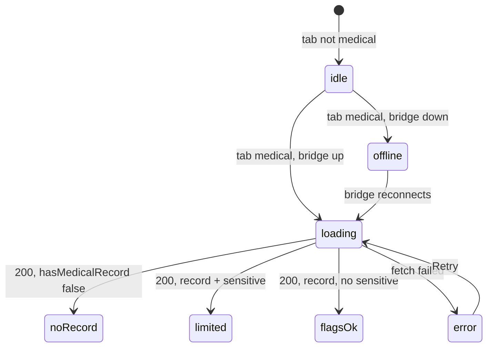

# Phase 1b — Medical summary UI (implementation plan)

**Status:** Plan only — no UI implementation in this pass.

**Goal:** Wire `GET /v1/patients/:patientId/medical-summary` into the Patient Profile **Medical** tab using the existing bridge client and contracts, with the same privacy posture as the profile and appointments tabs.

**References:**

- Backend: [phase-1b-medical-summary-backend.md](phase-1b-medical-summary-backend.md)
- Profile shell: [phase-1b-patient-profile-ui.md](phase-1b-patient-profile-ui.md)
- Contract: `packages/contracts/src/patient-medical-summary.ts`
- Client: `packages/bridge-client/src/client.ts` → `getPatientMedicalSummary(patientId)`
- Host panel: `packages/app/src/PatientProfilePanel.tsx`

---

## 1. Where the Medical tab lives

### 1.1 Panel hierarchy (unchanged outer shell)

`PatientProfilePanel` is rendered from `AppShell` when the user is on **Patients** and a `patientId` is set (see profile UI doc). The panel already owns:

1. Toolbar (**Back to Today**, **Clear patient**)
2. Global read-only note
3. **Profile gate** — empty / offline / loading profile / not found / error / **loaded**
4. When **loaded** only: summary **Card** + **tab strip** + **active tab panel**

Medical content must **not** render above the profile gate. If the profile fails to load, the user never sees medical UI.

### 1.2 Tab strip placement (exact location)

In `PatientProfilePanel.tsx`, inside the `state.phase === "loaded"` branch:

| Region | Lines (approx.) | Today | After implementation |
| --- | --- | --- | --- |
| Summary card | ~334–382 | Visible | Unchanged |
| `<nav aria-label="Patient sections">` | ~384–415 | **Appointments** enabled; **Medical** in `COMING_TABS` (disabled + “Soon”) | **Medical** promoted to a real tab button (same pattern as Appointments) |
| Tab panel | ~417+ | `#patient-panel-appointments` when `activeTab === "appointments"` | Add `#patient-panel-medical` when `activeTab === "medical"` |

**Concrete edits (when implementing):**

1. Remove `{ id: "medical", label: "Medical" }` from `COMING_TABS`.
2. Add a **Medical** `<li>` immediately after the Appointments `<li>` (before Treatments / Payments / Chart placeholders), with:
   - `id="patient-tab-medical"`
   - `aria-controls="patient-panel-medical"`
   - `aria-selected={activeTab === "medical"}`
   - `onClick={() => setActiveTab("medical")}`
   - Active class when selected (mirror Appointments).
3. Render `<section id="patient-panel-medical" role="tabpanel" aria-labelledby="patient-tab-medical">` as a sibling below the appointments panel, gated on `activeTab === "medical"`.

Treatments, Payments, and Chart stay disabled placeholders until their own phases.

### 1.3 Fetch gating (mirror Appointments)

Medical summary fetch runs **only when all** are true:

- `patientId !== null`
- `state.phase === "loaded"` (profile succeeded — medical tab is inside this branch)
- `activeTab === "medical"`
- `bridgeBaseUrl` trimmed non-empty
- `bridgePhase === "connected"`

Use the same patterns as the appointments `useEffect` (~216–254):

- `medRequestSeq` ref + cancellation on unmount/deps change
- `medRefreshNonce` for **Retry** / optional **Refresh**
- `createBridgeClient({ baseUrl, fetch: fetchImpl }).getPatientMedicalSummary(patientId)`
- **No** `console.log` of responses
- **Do not** prefetch medical summary on profile load (lazy per tab)

When `patientId` changes or becomes null, reset `activeTab` (existing effect ~256–263 already clears tab) and set medical load state to `idle`.

---

## 2. UI states

States are **layered**: panel-level (profile) vs tab-level (medical). The Medical tab panel implements the tab-level states below.

### 2.1 No patient selected (panel-level)

**Condition:** `patientId === null`

**UI:** Existing empty state — “No patient selected” (~303–308). Tab strip not shown.

**Fetch:** None.

### 2.2 Bridge offline (panel-level and tab-level)

**Panel-level** (`patientId` set, profile not loaded yet):

- `!base` or `bridgePhase !== "connected"` → profile `offline` empty state (~309–314).

**Tab-level** (profile loaded, user on Medical tab, bridge drops or was never connected for tab fetch):

- Mirror appointments: `EmptyState` title **Clinic service offline**, description to connect the bridge before medical summary loads.

**Fetch:** No medical request while offline.

### 2.3 Loading profile (panel-level)

**Condition:** `state.phase === "loading"`

**UI:** “Loading profile…” — Medical tab not visible yet.

**Fetch:** Profile only; no medical call.

### 2.4 Loading medical summary (tab-level)

**Condition:** Profile loaded, `activeTab === "medical"`, bridge connected, request in flight.

**UI:** Status line, e.g. `Loading medical summary…` (`role="status"`, `aria-live="polite"`).

**Fetch:** `GET …/medical-summary` in progress.

### 2.5 No medical record (tab-level)

**Condition:** HTTP **200**, body validates, `hasMedicalRecord === false`.

**Note:** This is **not** HTTP 404. Missing `MEDICAL` row for patient is a successful empty summary per backend doc.

**UI:** `EmptyState` title e.g. **No medical questionnaire on file**, description that the copy has no `MEDICAL` row for this patient id (neutral, no DBF names in user-facing copy if possible — prefer “medical questionnaire”).

**Show:** Optional echo of `patientId` only if already shown on profile card (avoid duplicating identifiers unnecessarily).

**Hide:** `conditions`, dates, counts (all zero/absent semantics).

### 2.6 Medical record exists — details hidden / limited preview (tab-level)

Split into two related presentations:

#### A. Sensitive free-text present (`hasSensitiveMedicalDetails === true`)

**Condition:** `hasMedicalRecord === true` and `hasSensitiveMedicalDetails === true`.

**UI:**

- Prominent **read-only** banner (not an error) using recommended copy (§5).
- Show **aggregate** fields only: `lastUpdated`, `lastDentalVisit` (if non-null), `flaggedConditionCount`.
- Show `privacyNote` from API (verbatim — it is a fixed literal in the contract).
- **Do not** render a per-flag list (problem/allergy/notes may exist off-screen in DBF; listing booleans could still feel like a clinical chart). Prefer count + dates + banners only.

#### B. Record exists, screening flags allowed (`hasMedicalRecord === true`, `hasSensitiveMedicalDetails === false`)

**UI:**

- Same read-only lede as §5 (always show once at top of tab panel).
- Summary `dl`: questionnaire date (`lastUpdated`), last dental visit (`lastDentalVisit`), **Flagged screening items** → `flaggedConditionCount`.
- Optional compact list of **only** keys where `conditions[key] === true`, using **generic human labels** from a static map (§4.2). Keys with `false` or `null` are omitted.
- `privacyNote` in a subdued footnote.

If `flaggedConditionCount === 0` but `hasMedicalRecord`, show copy like **No screening flags marked yes** (still show dates if present).

### 2.7 Failed to load (tab-level)

**Condition:** Network error, non-OK HTTP, schema mismatch, or unexpected throw from `getPatientMedicalSummary`.

**UI:** `role="alert"` + user-safe message from `safePatientMedicalSummaryError` (new helper, §6) + **Retry** button (increments `medRefreshNonce`).

**Map API codes** (no raw `error.message` in UI):

| Code | User-facing intent |
| --- | --- |
| `MEDICAL_DBF_NOT_FOUND` | Medical questionnaires not available on this bridge (data folder) |
| `DATA_ROOT_NOT_CONFIGURED` | Same family as profile offline / admin message |
| `INVALID_PATIENT_ID` | Invalid id for this request |
| `MEDICAL_SUMMARY_ERROR` | Generic load failure, try again |
| Network / invalid body | Same patterns as `safePatientProfileError` / `safePatientAppointmentsError` |

**404 on medical-summary:** Only when `MEDICAL.DBF` is missing — **not** “patient has no row”. Do not conflate with `PATIENT_NOT_FOUND`.

### 2.8 State diagram (tab-level, profile already loaded)



---

## 3. Fields allowed in UI

Only fields from `PatientMedicalSummaryResponseSchema` may appear in the DOM. No extra properties from raw JSON.

| Field | Use in UI |
| --- | --- |
| `patientId` | Optional; usually redundant with profile card — omit in medical panel unless needed for tests |
| `hasMedicalRecord` | Drives empty vs summary layout |
| `hasSensitiveMedicalDetails` | Drives “details hidden” / aggregate-only layout (§2.6A) |
| `lastUpdated` | Show as “Questionnaire date” when non-null; `—` when null |
| `lastDentalVisit` | Show as “Last dental visit (questionnaire)” when non-null; `—` when null |
| `flaggedConditionCount` | Always show as a number when `hasMedicalRecord` (including sensitive-only layout) |
| `conditions` | Only when `hasSensitiveMedicalDetails === false`; only entries with value `true`; labels from static map (§4.2) |
| `privacyNote` | Display verbatim in footnote or banner adjunct |

**Formatting:** Dates are `YYYY-MM-DD` from API — display as-is or with `Intl.DateTimeFormat` (same optional approach as appointment range headings). No timezone conversion required for plan.

**Counts:** Prefer API `flaggedConditionCount` over recomputing from `conditions` in UI (single source of truth).

---

## 4. Fields forbidden in UI

Never render, log, test-fixture into committed snapshots, or document with real values:

| Blocked | Reason |
| --- | --- |
| `PROBLEM` | Free-text clinical wording |
| `ALLERGY_TO` | Drug/allergy free text |
| `NOTES` | Memo narrative |
| Any other `MEDICAL` column not in contract | Raw row leakage |
| Raw DBF row / arbitrary column map | Privacy |
| `error.message` from bridge on failures | May leak internal detail |
| Blocked column **names** as visible UI copy | e.g. `PROBLEM`, `ALLERGY_TO`, `NOTES`, `PATIENT_ID`, `MEDICAL.DBF` in user strings |
| CamelCase API keys as visible labels | e.g. `heartTrouble`, `med1` — use generic map labels only |

**Contract fields not for display:**

- `hasSensitiveMedicalDetails` may drive layout but need not show as a labeled “true/false” row to end users — use copy in §5 instead.

### 4.1 Condition keys — display policy

| Policy | Keys |
| --- | --- |
| **Show with generic label when `true`** (only if §2.6B) | `hospital`, `physician`, `medicine`, `ill`, `reaction`, `bleeding`, `allergic`, `heartTrouble`, `congenitalHeart`, `heartMurmur`, `highBloodPressure`, `lowBloodPressure`, `anemia`, `rheumaticFever`, `jaundice`, `asthma`, `cough`, `kidneyTrouble`, `diabetes`, `tuberculosis`, `hepatitis`, `arthritis`, `stroke`, `epilepsy`, `psychiatric`, `sinusTrouble`, `pregnant`, `ulcers` |
| **Omit from named list** (legacy meaning unconfirmed; count still includes them via API) | `med1`, `med2` |
| **Stigmatizing / extra-care UX** | `aids` — **omit named label** in v1 UI; if `conditions.aids === true`, rely on `flaggedConditionCount` only (do not spell out in a bullet list). Revisit with SME before any dedicated label. |

Implement labels in a new module e.g. `packages/app/src/patient-medical-summary-display.ts` (constants only, no PHI).

**Example label map (implementation):**

| Key | Safe generic label |
| --- | --- |
| `hospital` | Hospital admission (screening) |
| `physician` | Under physician care (screening) |
| `medicine` | Taking medicine (screening) |
| `ill` | Serious illness (screening) |
| `reaction` | Adverse reaction (screening) |
| `bleeding` | Bleeding tendency (screening) |
| `allergic` | Allergies indicated (screening flag only) |
| `heartTrouble` | Heart trouble (screening) |
| `congenitalHeart` | Congenital heart condition (screening) |
| `heartMurmur` | Heart murmur (screening) |
| `highBloodPressure` | High blood pressure (screening) |
| `lowBloodPressure` | Low blood pressure (screening) |
| `anemia` | Anemia (screening) |
| `rheumaticFever` | Rheumatic fever (screening) |
| `jaundice` | Jaundice (screening) |
| `asthma` | Asthma (screening) |
| `cough` | Persistent cough (screening) |
| `kidneyTrouble` | Kidney trouble (screening) |
| `diabetes` | Diabetes (screening) |
| `tuberculosis` | Tuberculosis (screening) |
| `hepatitis` | Hepatitis (screening) |
| `arthritis` | Arthritis (screening) |
| `stroke` | Stroke (screening) |
| `epilepsy` | Epilepsy (screening) |
| `psychiatric` | Psychiatric condition (screening) |
| `sinusTrouble` | Sinus trouble (screening) |
| `pregnant` | Pregnancy (screening) |
| `ulcers` | Ulcers (screening) |

Append “(screening)” or use a single tab lede so staff understand these are legacy Y/N flags, not diagnoses.

---

## 5. Recommended UI copy

**Tab lede (always at top of medical panel):**

> Medical summary is read-only. Detailed notes and allergy text are hidden in this preview.

**When `hasSensitiveMedicalDetails`:**

> Additional problem, allergy, or note fields exist in the legacy record but are not shown here.

**Footer:** Render API `privacyNote` as secondary text:

> Problem description, allergy free text, and medical notes remain hidden until field mapping is reviewed.

Do not paraphrase `privacyNote` in code — import type ensures literal match; display the string from the response object.

**Align with profile panel:** Global note already says profile is read-only (~298–300); medical tab lede is **additional** and specific to `MEDICAL.DBF` hiding rules.

---

## 6. Error helper (implementation)

Add `safePatientMedicalSummaryError(e: unknown): string` next to `safePatientProfileError` / `safePatientAppointmentsError` in `PatientProfilePanel.tsx` (or extract to `patient-medical-summary-errors.ts` if the panel grows).

Mirror:

- `network` → clinic service unreachable
- `http` + `MEDICAL_DBF_NOT_FOUND` / `DATA_ROOT_NOT_CONFIGURED` → admin/data folder copy
- `http` + `INVALID_PATIENT_ID` → invalid id
- `http` + `MEDICAL_SUMMARY_ERROR` or unknown → generic retry message
- `invalid_body` + schema mismatch flag → mapping fix message (no data changed)
- Default → generic load failure

Export for unit tests (same as other `safe*` helpers).

---

## 7. Recommended tests (when implementing)

Extend `packages/app/src/patient-profile-panel.test.tsx` (and optionally add `patient-medical-summary-display.test.ts` for label map keys).

Use **synthetic** fixtures only — never real copy data paths or real medical strings.

| Test | Assert |
| --- | --- |
| Medical tab not in DOM when `patientId === null` | No medical fetch URL |
| Profile offline | No `/medical-summary` fetch |
| Medical tab inactive | No `/medical-summary` fetch after profile loads |
| Tab click activates fetch | URL contains `/v1/patients/42/medical-summary` |
| Loading | “Loading medical summary” (or chosen copy) visible |
| `hasMedicalRecord: false` | Empty state; no condition labels |
| Record + `hasSensitiveMedicalDetails: true` | Count/dates if present; **no** `conditions` key names in text; lede + `privacyNote` present |
| Record + sensitive false, flags | Generic labels for `true` flags only; `med1`/`med2`/`aids` names not as visible labels |
| HTTP 500 / `MEDICAL_SUMMARY_ERROR` | Generic error; raw `message` not in DOM |
| `MEDICAL_DBF_NOT_FOUND` | Dedicated unavailable copy |
| Retry | Second fetch after click |
| Blocked leakage | Fixture includes decoy strings in mock body for `PROBLEM` / `ALLERGY_TO` — must **not** appear in `textContent` even if mistakenly added to mock (mock should not include them; separate test ensures UI never prints column names `PROBLEM`, `ALLERGY_TO`, `NOTES`) |
| Blocked field names | `textContent` must not match `/\b(PROBLEM|ALLERGY_TO|NOTES)\b/` as UI labels |
| `safePatientMedicalSummaryError` | Unit cases for codes above |

**Fixture shape example (synthetic):**

```ts
const syntheticMedicalSummary = {
  patientId: "42",
  hasMedicalRecord: true,
  hasSensitiveMedicalDetails: false,
  lastUpdated: "2024-06-01",
  lastDentalVisit: "2024-01-10",
  flaggedConditionCount: 2,
  conditions: { asthma: true, diabetes: true, /* others false/null */ },
  privacyNote:
    "Problem description, allergy free text, and medical notes remain hidden until field mapping is reviewed.",
};
```

Do not embed `SYNTHETIC_MEDICAL_PROBLEM_TOKEN` or similar in UI tests unless asserting absence from DOM.

---

## 8. Implementation steps (ordered)

1. **`patient-medical-summary-display.ts`** — `MEDICAL_CONDITION_LABELS` map, `medicalConditionItemsForDisplay(conditions)` returning `{ key, label }[]` for `true` only, excluding `med1`, `med2`, `aids`.
2. **`safePatientMedicalSummaryError`** — export + unit tests.
3. **`PatientProfilePanel.tsx`**
   - `MedLoadState` type (`idle` | `offline` | `loading` | `no_record` | `summary_sensitive` | `summary_flags` | `error`)
   - State + refs + `useEffect` for medical fetch (§1.3).
   - Remove Medical from `COMING_TABS`; add Medical tab button + panel (§1.2).
   - Render states §2.4–2.7 with components from `@microdent/ui` (`EmptyState`, `Card`, `Badge` for count optional).
4. **Styles** — reuse `app-patient-profile__*` classes (e.g. `__appts` → `__medical` or shared `__tab-panel`) for consistent spacing; no new dependencies.
5. **Tests** — §7.
6. **Docs** — update [phase-1b-patient-profile-ui.md](phase-1b-patient-profile-ui.md) “Future tabs” bullet to note Medical implemented; link this plan.

**Out of scope (do not implement in this phase):**

- Editing or POST/PUT to medical data
- Showing allergy substance names or problem descriptions
- TanStack Query, new routes in React Router
- Prefetching medical on profile load
- Legacy EXE or `Microdent-Legacy` folder access

---

## 9. Privacy checklist (implementation sign-off)

- [ ] No `console.log` of medical summary JSON
- [ ] Fetch only when Medical tab selected
- [ ] DOM contains only allowlisted fields (§3)
- [ ] Sensitive layout suppresses per-flag list (§2.6A)
- [ ] Tests use synthetic data only
- [ ] No screenshots or docs with real medical values
- [ ] `hasSensitiveMedicalDetails` never shown as “true” to users — use copy only

---

## 10. Uncertainty (carry forward)

- **`med1` / `med2`:** counted in API but not labeled until SME confirms FoxPro meaning.
- **`aids` flag:** excluded from named list pending UX/policy review.
- **Multiple `MEDICAL` rows:** backend picks latest `DATE`; UI should show `lastUpdated` consistent with that row without explaining merge rules to users.
- **`allergic` boolean vs `ALLERGY_TO` text:** UI must never imply allergy text is shown when only the boolean is available.
