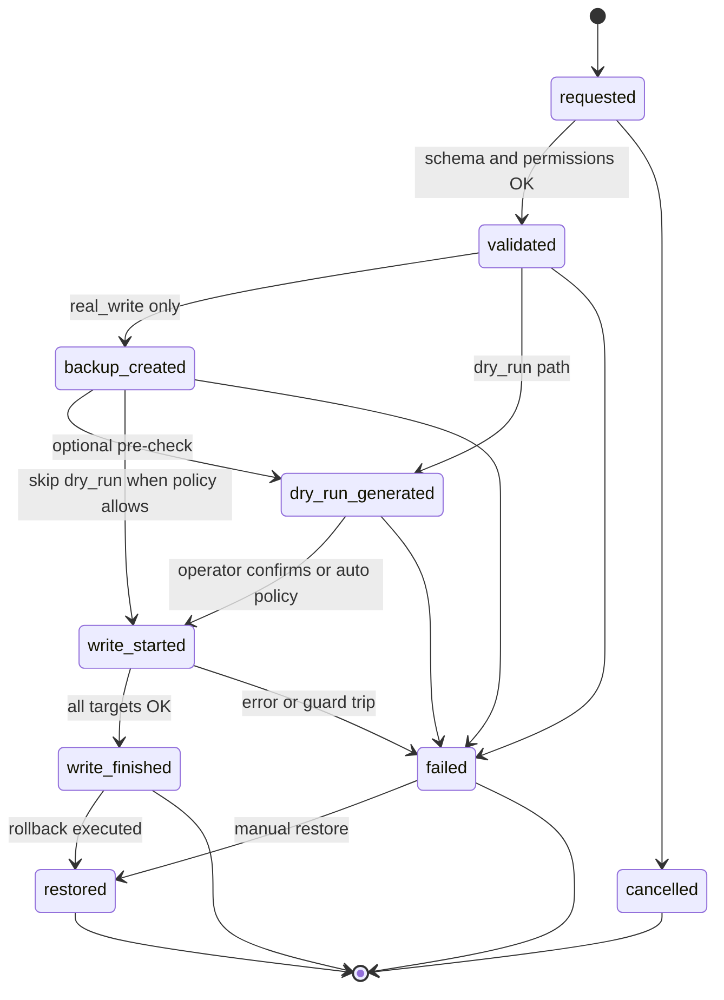

# Phase 3 — Write audit log plan

**Status:** Planning only — **no write APIs, no backup executors, and no audit migrations** in this band.

**Scope:** Define the audit trail required **before** any mutation support (Phase 4 writes). Every future write attempt must be reconstructable for operations and security review **without** storing PHI, raw row payloads, or financial/medical free text.

**Related:** `docs/phase-2-sqlite-mirror-plan.md` (`import_runs` / `import_errors`), `docs/phase-1a-safety-module.md`, `docs/master-build-plan.md` (Phase 4: backups, audit, flags, dry-run).

**Constraints (unchanged):**

- No reads from `Microdent-Legacy`; copy tree only for study.
- All implementation stays under `Microdent-Modern`.
- Synthetic identifiers in examples below (e.g. `op_7f3a…`, `patient_id = "10042"` as opaque id only).

---

## 1. Audit log purpose

The write audit log answers four questions for every mutation attempt:

1. **Who initiated it?** — Operator or automation identity when available (session/user id), never patient identity.
2. **What was attempted?** — Workflow type, target logical tables, and **record ids only** (primary keys / legacy keys as opaque strings).
3. **How was it executed?** — Dry-run vs real write, backup linkage, step timeline, terminal status.
4. **What happened?** — Success, partial success, failure, or restore; sanitized error codes and messages.

It is **not** a clinical record, billing journal, or debug dump. It complements (does not replace) OS-level backups and application-level snapshot stores.

**Non-goals for this plan:**

- Implementing write handlers, DBF pack/reindex, or bridge `POST`/`PATCH` routes.
- Storing before/after column values, SQL text with literals, or request bodies containing PHI.
- Shipping audit rows to remote telemetry (local SQLite + optional operator-export only).

---

## 2. What gets logged

Each write **operation** receives a stable **`operation_id`** (UUID v4 or ULID string) at first touch. All child rows reference this id.

| Field / concept | Required | Storage | Notes |
| --- | --- | --- | --- |
| **operation_id** | Yes | `write_audit_log.operation_id` (PK) | Correlates steps, errors, backups, and UI “operation detail” views. |
| **timestamp** | Yes | ISO-8601 UTC on log row + per-step `created_at` | `requested_at` on parent; finer granularity on steps. |
| **user / session identifier** | If available | `actor_type`, `actor_id` | e.g. `user:usr_synthetic_01`, `session:sess_9c2…`, `cli:mirror-import`. Never patient name. |
| **workflow type** | Yes | `workflow_type` TEXT | Closed enum (see §5). Examples: `appointment.create`, `patient.demographics.update`. |
| **table names** | Yes | `target_tables` JSON array | Logical table names only (`SCHEDULE`, `patients` mirror table, etc.). |
| **record ids only** | Yes | `target_record_ids` JSON array of objects | `{ "table": "SCHEDULE", "id": "88421" }` — ids only, no field map. |
| **dry-run vs real write** | Yes | `execution_mode` | `dry_run` \| `real_write`. Real writes forbidden until audit + backup gates pass. |
| **backup id** | When backup runs | `backup_id` FK or text | Links to backup catalog row (§7). Null for dry-run-only ops that skip backup. |
| **result status** | Yes | `status` on parent + step-level | Terminal: `success`, `partial`, `failed`, `restored`, `cancelled`. |
| **error code** | On failure | `write_errors.error_code` | Stable machine code (e.g. `VALIDATION_RECORD_LOCKED`). |

**Optional safe metadata** (allowed if non-PHI):

- `client_request_id` — idempotency key from UI (opaque).
- `feature_flags` — JSON map of flag names → booleans (e.g. `WRITE_APPOINTMENTS_ENABLED`).
- `record_count` — integer summary (e.g. `3` rows touched).
- `data_root_fingerprint` — same pattern as `import_runs` (hash of path metadata, not path with patient data).
- `bridge_version` / `app_version` — build identifiers for support.

---

## 3. What must never be logged

The following are **explicitly forbidden** in `write_audit_log`, `write_audit_steps`, `write_errors`, bridge logs, and exported audit bundles:

| Category | Examples (do not store) |
| --- | --- |
| Patient names | Full or partial legal/preferred names |
| Full phones | Unmasked numbers; log `phone_mask` pattern only if needed for ops (`***-**12`) |
| Addresses | Street, city, postal |
| Notes | Appointment notes, chart notes, quick notes |
| Medical free text | Problems, allergies text, memo bodies |
| Payment amounts | Charges, payments, balances, write-off amounts |
| Raw rows | Full DBF/SQLite row JSON, `INSERT`/`UPDATE` literals, memo fields |
| Credentials | Tokens, passwords, connection strings with secrets |

**Error messages** must use templated, code-first text: `"Record locked (table=SCHEDULE, id=88421)"` — never `"Cannot update Jane Doe's appointment"`.

**Redaction rule:** If a developer is unsure whether a field is PHI, treat it as forbidden and log only **table + id + code**.

---

## 4. Proposed SQLite audit tables

Audit tables live in the **operator SQLite** database (same file as mirror schema or a dedicated `audit.sqlite` — decision at implementation; FKs must be consistent). Suggested migration band: `00N_write_audit.sql` after mirror schema is stable.

### 4.1 `write_audit_log` (one row per operation)

Parent record for the full lifecycle.

```sql
CREATE TABLE IF NOT EXISTS write_audit_log (
  operation_id TEXT NOT NULL PRIMARY KEY,
  requested_at TEXT NOT NULL,
  finished_at TEXT,
  status TEXT NOT NULL CHECK (status IN (
    'requested', 'validated', 'backup_created', 'dry_run_generated',
    'write_started', 'write_finished', 'failed', 'restored', 'cancelled'
  )),
  workflow_type TEXT NOT NULL,
  execution_mode TEXT NOT NULL CHECK (execution_mode IN ('dry_run', 'real_write')),
  actor_type TEXT CHECK (actor_type IN ('user', 'session', 'service', 'cli', 'unknown')),
  actor_id TEXT,
  target_tables TEXT NOT NULL,           -- JSON array of strings
  target_record_ids TEXT NOT NULL,       -- JSON array of { table, id }
  backup_id TEXT,                        -- references write_backups.backup_id (future table)
  terminal_status TEXT CHECK (terminal_status IN (
    'success', 'partial', 'failed', 'restored', 'cancelled'
  )),
  record_count INTEGER,
  client_request_id TEXT,
  feature_flags TEXT,                  -- JSON object, flag names only
  data_root_fingerprint TEXT,
  bridge_version TEXT,
  app_version TEXT
);
```

Indexes:

- `idx_write_audit_log_requested` on `requested_at DESC`
- `idx_write_audit_log_workflow` on `(workflow_type, requested_at DESC)`
- `idx_write_audit_log_backup` on `backup_id` where not null

### 4.2 `write_audit_steps` (append-only timeline)

Fine-grained state transitions and safe checkpoints. One operation has many steps.

```sql
CREATE TABLE IF NOT EXISTS write_audit_steps (
  step_id INTEGER NOT NULL PRIMARY KEY AUTOINCREMENT,
  operation_id TEXT NOT NULL REFERENCES write_audit_log (operation_id) ON DELETE CASCADE,
  step_name TEXT NOT NULL,             -- e.g. validate, backup_start, dry_run, write_row
  lifecycle_status TEXT NOT NULL CHECK (lifecycle_status IN (
    'requested', 'validated', 'backup_created', 'dry_run_generated',
    'write_started', 'write_finished', 'failed', 'restored'
  )),
  created_at TEXT NOT NULL,
  duration_ms INTEGER,
  detail_code TEXT,                      -- optional safe token, e.g. ROW_COUNT_CONFIRMED
  detail_json TEXT                       -- optional: counts, table names only — no row payloads
);
```

Index: `idx_write_audit_steps_operation` on `(operation_id, step_id)`.

### 4.3 `write_errors` (sanitized failures)

Parallel to `import_errors`: multiple errors per operation allowed; no cell values.

```sql
CREATE TABLE IF NOT EXISTS write_errors (
  error_id INTEGER NOT NULL PRIMARY KEY AUTOINCREMENT,
  operation_id TEXT NOT NULL REFERENCES write_audit_log (operation_id) ON DELETE CASCADE,
  step_id INTEGER REFERENCES write_audit_steps (step_id) ON DELETE SET NULL,
  error_code TEXT NOT NULL,
  message TEXT NOT NULL,                 -- templated, no PHI
  target_table TEXT,
  target_record_id TEXT,
  created_at TEXT NOT NULL
);
```

Index: `idx_write_errors_operation` on `operation_id`.

### 4.4 Future: `write_backups` (catalog only — not implemented here)

Backups are files on disk; SQLite stores **metadata** for linkage:

| Column | Purpose |
| --- | --- |
| `backup_id` | PK (UUID) — referenced by `write_audit_log.backup_id` |
| `operation_id` | Originating write op (nullable if manual backup) |
| `created_at` | ISO-8601 |
| `backup_kind` | `dbf_snapshot` \| `sqlite_file` \| `manifest_only` |
| `storage_path_hash` | SHA-256 of absolute path or relative key — **not** full path if it embeds clinic name |
| `byte_size` | Integer |
| `file_fingerprint` | Hash of manifest or archive |
| `status` | `pending` \| `verified` \| `failed` \| `restored_from` |

No file contents in SQLite.

---

## 5. Operation lifecycle

Lifecycle values align with `write_audit_log.status` (current state) and are echoed on each `write_audit_steps.lifecycle_status` (historical).



| Status | Meaning | Typical step_name |
| --- | --- | --- |
| **requested** | Op accepted; id issued | `accept_request` |
| **validated** | AuthZ, flags, id existence, lock checks | `validate_targets` |
| **backup_created** | Snapshot manifest recorded | `backup_complete` |
| **dry_run_generated** | Simulated diff counts / lock report | `dry_run_complete` |
| **write_started** | Mutating I/O begun | `write_begin` |
| **write_finished** | Committed successfully | `write_commit` |
| **failed** | Terminal error | `write_abort` |
| **restored** | Restored from linked backup | `restore_complete` |

**Rules:**

- **Dry-run:** Must reach at least `dry_run_generated` before UI shows “Apply”. `execution_mode = dry_run` never advances to `write_started` unless operator starts a **new** operation with `real_write`.
- **Real write:** `backup_created` is mandatory before `write_started` (master plan Phase 4).
- **Partial:** `terminal_status = partial` with `write_finished` or `failed` depending on whether commit was all-or-nothing per workflow.
- Parent `status` always reflects **latest** lifecycle state; steps retain history.

---

## 6. Linking audit records to backups

1. **Issue `operation_id`** at `requested`.
2. On real-write path, create **`backup_id`** in `write_backups` (future) **before** any DBF/SQLite mutation.
3. Set `write_audit_log.backup_id` and append step `backup_created` with `detail_json` like:
   `{"backup_id":"bkp_synthetic_01","file_count":12,"verified":true}` — counts and ids only.
4. Store backup files under a configured **`BACKUP_ROOT`** outside the repo; path never logged in full — use `storage_path_hash` + operator-local lookup table if needed.
5. On **restore**, new operation with `workflow_type = system.restore` references **same** `backup_id`; terminal `restored` on both restore op and optionally annotate original op via step `detail_code = RESTORED_BY_OPERATION`.

**Correlation for support:**

```
operation_id  →  write_audit_log.backup_id  →  write_backups.backup_id
             →  write_audit_steps (timeline)
             →  write_errors (if any)
```

UI/CLI “operation detail” loads by `operation_id` only; backup files resolved locally by `backup_id`.

---

## 7. Troubleshooting without PHI

| Need | Safe source |
| --- | --- |
| Last failed write | `write_audit_log` where `terminal_status = failed` ORDER BY `requested_at` DESC |
| Why it failed | `write_errors.error_code` + templated `message` |
| Timeline | `write_audit_steps` ordered by `step_id` |
| Affected records | `target_record_ids` (ids only) |
| Dry-run vs applied | `execution_mode` + distinct `operation_id`s |
| Backup usable? | `write_backups.status`, `file_fingerprint` — verify out-of-band |

**Operator views (future):**

- `GET /v1/audit/operations?from=&to=&status=` — list DTO: operation_id, timestamps, workflow_type, status, record_count — **no** target names.
- `GET /v1/audit/operations/:operationId` — steps + errors + backup_id.

**Logs:** Bridge structured logs include `operation_id`, `workflow_type`, `error_code` — same redaction rules as §3.

**Synthetic support example:**

```json
{
  "operation_id": "op_synthetic_7f3a",
  "workflow_type": "appointment.update",
  "status": "failed",
  "target_record_ids": [{ "table": "SCHEDULE", "id": "88421" }],
  "errors": [{ "error_code": "VALIDATION_RECORD_LOCKED", "message": "Record locked (table=SCHEDULE, id=88421)" }]
}
```

---

## 8. Relationship to import audit

| Aspect | `import_runs` (Phase 2) | `write_audit_log` (Phase 3+) |
| --- | --- | --- |
| Purpose | ETL / mirror ingest | Mutations |
| Primary key | `run_id` INTEGER | `operation_id` TEXT |
| Child errors | `import_errors` | `write_errors` |
| Steps | Implicit (status on parent) | Explicit `write_audit_steps` |
| PHI policy | No cell values | Same + no record payloads |
| Dry-run | N/A | Required gate for writes |

Import and write audit may share one SQLite file but **must not** share tables — different lifecycles and retention policies.

---

## 9. Tests required before write support

All tests use **synthetic** ids and fixture DB paths only.

### 9.1 Schema / migration

- [ ] Migration applies cleanly on empty DB and on DB with existing mirror tables.
- [ ] FK: deleting parent `write_audit_log` cascades steps and errors.
- [ ] CHECK constraints reject invalid `status`, `execution_mode`, `lifecycle_status`.

### 9.2 Audit API / repository (unit)

- [ ] `beginOperation` inserts `requested` row with required fields.
- [ ] `appendStep` updates parent `status` and inserts step row atomically (transaction).
- [ ] `recordError` never persists forbidden keys (lint or schema guard on `message` / `detail_json`).
- [ ] `finishOperation` sets `finished_at` and `terminal_status`.

### 9.3 Lifecycle integration

- [ ] Dry-run path: `requested` → `validated` → `dry_run_generated`; never `write_started`.
- [ ] Real-write path: requires `backup_created` before `write_started` (guard test fails if skipped).
- [ ] Failed op: terminal `failed` + at least one `write_errors` row; no row payload columns populated.

### 9.4 Backup linkage

- [ ] `backup_id` set on parent when backup catalog row exists.
- [ ] Restore workflow references prior `backup_id` and ends in `restored`.

### 9.5 Logging redaction

- [ ] Bridge log sink test: given a mock write payload with name/phone/note fields, log output contains **only** operation_id and error_code.

### 9.6 Contract / HTTP (when routes exist)

- [ ] List/detail audit DTOs validated with Zod — no optional string fields for PHI categories in §3.
- [ ] 404 for unknown `operation_id` without leaking other ops.

### 9.7 Regression with read-only guarantees

- [ ] Existing safety tests still pass: no `O_RDWR` on DATA_ROOT without explicit write feature flag.
- [ ] Phase 1 `GET`-only routes unchanged until write flag enabled.

---

## 10. Implementation order (after this plan)

1. **3.a** — SQL migration for three audit tables (+ `write_backups` catalog).
2. **3.b** — TypeScript `WriteAuditRepository` mirroring `import-run.ts` patterns.
3. **3.c** — Unit tests (§9.1–9.2) with in-memory SQLite.
4. **3.d** — Read-only audit list/detail HTTP routes (no writes).
5. **Phase 4** — Wire repository into write handlers; enforce lifecycle guards.

---

## 11. Definition of done (this document)

- [x] `docs/phase-3-audit-log-plan.md` exists.
- [x] No write handler or backup executor code in this band.
- [x] No PHI, payment amounts, or raw row values in examples or schemas.

---

## 12. Open decisions (resolve before 3.a)

| Decision | Options |
| --- | --- |
| Audit DB file | Same `SQLITE_PATH` as mirror vs dedicated `AUDIT_SQLITE_PATH` |
| Retention | Keep all ops vs prune > N days (ops table only, never touch backup files) |
| JSONL export | Optional append-only export for SIEM — must obey §3 redaction |
| Actor identity | Desktop login vs bridge API token vs both |

---

*Planning artifact only. Implementation tracked under Phase 3.a+ bands; writes remain Phase 4.*
