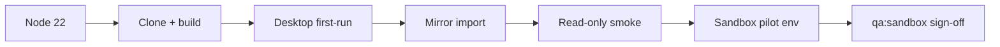

# Phase 6 — Windows MVP operator guide

**Purpose:** Single Windows-first narrative to install, build, configure desktop, import mirror data, validate read-only behavior, optionally enable sandbox write pilot UI, and sign off sandbox QA — without reading application source. Use placeholder paths like `C:\Microdent\...` only; never paste real patient data, chart numbers, or production UNC paths into docs or tickets.

**Related:** [phase-5-operator-qa-runbook.md](./phase-5-operator-qa-runbook.md) (detailed QA tracks), [phase-4-windows-operator-quickstart.md](./phase-4-windows-operator-quickstart.md) (compact deploy), [phase-3-windows-readiness-audit.md](./phase-3-windows-readiness-audit.md) (script classification), [out-of-scope-guardrails.md](./out-of-scope-guardrails.md), [scripts/README.md](../scripts/README.md), [apps/desktop/README.md](../apps/desktop/README.md).

**Startup failures:** If the desktop app cannot start, an error dialog shows a masked message (bridge build, required paths, health timeout). Check `%AppData%\Microdent\config.json` and rebuild bridge/web dist before retrying.

---

## Hard rules (read first)

| Rule | Requirement |
| --- | --- |
| **Never `DATA_ROOT` on live legacy** | Do **not** point `DATA_ROOT` at `C:\Microdent\Microdent-Legacy` (or any tree FoxPro still writes). Use **`C:\Microdent\Legacy-Copy\DATA`** for read-only mirror import only. |
| **Writes = sandbox only** | Writable `DATA_ROOT` must be `C:\Microdent\Write-Sandbox\DATA` with `.microdent-write-sandbox.json` (`disposable: true`). |
| **Pilot UI is opt-in** | `VITE_SANDBOX_WRITE_PILOT=true` plus bridge `WRITE_MODE=enabled` and operator ack — never on production legacy. |
| **No new write domains** | Four sandbox workflows only: appointment status, time move, create, patient demographics. **No** payments, ledger, memos, or chart writes. |
| **No PHI in logs/docs** | Log HTTP status, `workflow`, `operationId`, hash prefixes, backup basenames — not names, phones, or row bodies. |
| **Stable bridge in QA** | Use `node services\bridge\dist\server.js` — not `tsx watch`. Sandbox smoke calls **`node dist\cli\*.js`** directly (no mid-run `pnpm legacy:*`). |

---

## Path placeholders

| Role | Placeholder |
| --- | --- |
| Read-only legacy copy (mirror import) | `C:\Microdent\Legacy-Copy\DATA` |
| Disposable write sandbox | `C:\Microdent\Write-Sandbox\DATA` |
| Mirror SQLite | `C:\Microdent\mirror\MICRODENT_MIRROR.sqlite` |
| Sandbox backups | `C:\Microdent\Write-Sandbox\backups` |
| Repo clone | `C:\Microdent\Microdent-Modern` |
| Desktop config | `%AppData%\Microdent\config.json` |

Quote paths that contain spaces in PowerShell (`"C:\Microdent\My Sandbox\DATA"`). Prefer drive letters over UNC when possible.

---

## End-to-end flow



| Step | Section | Pass signal |
| --- | --- | --- |
| 1 | [Install Node 22](#1-install-node-22) | `node -v` → v22.x |
| 2 | [Clone and build](#2-clone-and-build) | `dist\server.js`, `apps\web\dist\index.html` exist |
| 3 | [Desktop first-run](#3-desktop-first-run) | Config saved; app opens; bridge healthy |
| 4 | [Mirror import](#4-mirror-import) | `import-safe` exit 0; Settings mirror metadata fresh |
| 5 | [Read-only smoke](#5-read-only-smoke) | `pnpm test` + `pnpm build:web` exit 0 |
| 6 | [Sandbox write pilot](#6-sandbox-write-pilot-optional) | Pilot panels visible when capability allows |
| 7 | [Sandbox QA](#7-sandbox-qa-sign-off) | `pnpm qa:sandbox` exit 0 (Git Bash) or manual equivalent |

---

## 1. Install Node 22

1. Install **Node 22 LTS** (64-bit) from [nodejs.org](https://nodejs.org/) or your org package manager.
2. Install **pnpm** 9.x if not bundled (`corepack enable` or standalone installer).
3. Verify:

```powershell
node -v    # v22.x
pnpm -v
```

Optional: install **Git for Windows** if you plan to run `pnpm qa:sandbox` (bash, `curl`, `jq`, `sqlite3`).

---

## 2. Clone and build

```powershell
cd C:\Microdent\Microdent-Modern
pnpm install
pnpm --filter @microdent/contracts run build
pnpm --filter @microdent/bridge run build
pnpm build:web
pnpm --filter @microdent/desktop run build
```

Fast synthetic sandbox rules (no HTTP):

```powershell
pnpm sandbox:validate
```

Confirm artifacts:

| Artifact | Path |
| --- | --- |
| Bridge server | `services\bridge\dist\server.js` |
| Legacy CLIs | `services\bridge\dist\cli\legacy-backup.js`, `legacy-restore.js`, … |
| Web UI | `apps\web\dist\index.html` |

---

## 3. Desktop first-run

1. Ensure `config.json` has no `dataRoot` / `sqlitePath` (or delete those keys) so setup opens.
2. Start:

```powershell
pnpm --filter @microdent/desktop run start
```

3. In the setup window, enter **absolute** paths:

| Field | Placeholder example |
| --- | --- |
| DATA_ROOT | `C:\Microdent\Write-Sandbox\DATA` |
| SQLITE_PATH | `C:\Microdent\mirror\MICRODENT_MIRROR.sqlite` |
| BACKUP_DIR (optional) | `C:\Microdent\Write-Sandbox\backups` |

4. Setup saves `%AppData%\Microdent\config.json` with `writeMode: "disabled"` and starts the bridge (`node …\dist\server.js` only — no FoxPro `.exe`).

Example saved config (placeholders):

```json
{
  "version": 1,
  "bridgePort": 17890,
  "writeMode": "disabled",
  "dataRoot": "C:\\Microdent\\Write-Sandbox\\DATA",
  "sqlitePath": "C:\\Microdent\\mirror\\MICRODENT_MIRROR.sqlite",
  "backupDir": "C:\\Microdent\\Write-Sandbox\\backups"
}
```

**Settings check:** Open **Settings** — bridge connected, paths configured (masked in production UI), write mode disabled, sandbox marker valid when using Write-Sandbox `DATA_ROOT`.

---

## 4. Mirror import

Mirror refresh is **CLI-only** (Settings only re-fetches metadata).

```powershell
$env:DATA_ROOT = "C:\Microdent\Legacy-Copy\DATA"
$env:SQLITE_PATH = "C:\Microdent\mirror\MICRODENT_MIRROR.sqlite"
cd C:\Microdent\Microdent-Modern
pnpm --filter @microdent/sqlite-mirror run import-safe
```

**Pass:** exit code `0`; stdout shows table names, row counts, and status tokens — no patient names or DBF row dumps.

**UI:** Settings → Mirror → **Refresh status** — recent `finishedAt`, `sqliteUsable`. Re-run CLI when data is stale (>48h warning).

Details: [phase-4-mirror-import-operator.md](./phase-4-mirror-import-operator.md).

---

## 5. Read-only smoke

From repo root:

```powershell
cd C:\Microdent\Microdent-Modern
pnpm test
pnpm build:web
```

| Command | Proves |
| --- | --- |
| `pnpm test` | Contracts, bridge, mirror, app Vitest bands |
| `pnpm build:web` | Production web bundle |
| `pnpm sandbox:validate` | Fast disposable-sandbox guard rules (optional) |

### Optional live HTTP (read-only bridge)

With `WRITE_MODE=disabled` and read-only `DATA_ROOT` (Legacy-Copy or fixtures):

```powershell
$env:DATA_ROOT = "C:\Microdent\Legacy-Copy\DATA"
$env:SQLITE_PATH = "C:\Microdent\mirror\MICRODENT_MIRROR.sqlite"
$env:WRITE_MODE = "disabled"
node services\bridge\dist\server.js
```

| Check | Request | Pass |
| --- | --- | --- |
| Health | `GET http://127.0.0.1:17890/health` | `"ok": true` |
| Writes off | `GET /v1/meta/write-capability` | `writableSandbox: false` when disabled |
| Mirror | `GET /v1/mirror/status` | Metadata only — no row payloads in logs |

Browser checklist: [phase-1b-manual-qa-checklist.md](./phase-1b-manual-qa-checklist.md).

---

## 6. Sandbox write pilot (optional)

Pilot UI exposes four **sandbox-gated** workflows (status, time move, create, demographics). Requires disposable marker, mirror rows, and bridge write ack.

### Bridge (disposable sandbox only)

```powershell
$env:DATA_ROOT = "C:\Microdent\Write-Sandbox\DATA"
$env:SQLITE_PATH = "C:\Microdent\mirror\MICRODENT_MIRROR.sqlite"
$env:BACKUP_DIR = "C:\Microdent\Write-Sandbox\backups"
$env:WRITE_MODE = "enabled"
$env:ALLOW_LEGACY_WRITES = "I_UNDERSTAND_THIS_IS_A_DISPOSABLE_COPY"
```

Confirm marker exists: `C:\Microdent\Write-Sandbox\DATA\.microdent-write-sandbox.json`.

### UI build flag

For Vite dev/preview, in `apps\web\.env.local`:

```
VITE_SANDBOX_WRITE_PILOT=true
```

Restart dev server or rebuild web/desktop. Production builds stay read-only unless this is set at build time deliberately.

**In app:** Schedule and patient profile show sandbox pilot banners; dry-run before commit; no payment/memo/chart write UI.

Checklist: [phase-3-write-safe-qa-checklist.md](./phase-3-write-safe-qa-checklist.md).

---

## 7. Sandbox QA sign-off

### Git Bash on Windows (recommended when available)

```bash
export DATA_ROOT="C:/Microdent/Write-Sandbox/DATA"
export SQLITE_PATH="C:/Microdent/mirror/MICRODENT_MIRROR.sqlite"
export BACKUP_DIR="C:/Microdent/Write-Sandbox/backups"
export WRITE_MODE="enabled"
export ALLOW_LEGACY_WRITES="I_UNDERSTAND_THIS_IS_A_DISPOSABLE_COPY"
cd /c/Microdent/Microdent-Modern
pnpm qa:sandbox
```

**Pass:** exit `0`; log ends with `qa:sandbox complete` and `qa-sandbox-write-smoke complete (4 workflows)`.

**What runs:** `qa-sandbox-run.sh` builds bridge, starts `node services/bridge/dist/server.js`, then smoke. Inside smoke, backup/restore use **`(cd services/bridge && node dist/cli/legacy-backup.js)`** — not `pnpm legacy:backup` mid-orchestration.

### Native Windows (no bash)

Follow [phase-5-operator-qa-runbook.md](./phase-5-operator-qa-runbook.md) §5: build → set env → `node services\bridge\dist\server.js` → poll health/write-capability → four workflows with `pnpm --filter @microdent/bridge run legacy-backup` / `legacy-restore` (each resolves to `node dist/cli/*.js`).

Deferred: cross-platform `scripts/qa-sandbox-run.mjs` (see audit deferred table).

---

## Troubleshooting

| Symptom | Likely cause | Fix |
| --- | --- | --- |
| Health poll never succeeds | Bridge not started, wrong port, firewall | Confirm `node services\bridge\dist\server.js` running; check `BRIDGE_PORT=17890`, `BRIDGE_HOST=127.0.0.1` |
| Port **17890** in use | Stale bridge or dev server | Windows: `netstat -ano \| findstr 17890` then end owning PID; avoid `pnpm dev:bridge` for QA |
| `listen EPERM` / `tsx-*` in backup path | Legacy CLI still on **tsx** IPC | `pnpm --filter @microdent/bridge run build`; smoke must use **`node dist/cli/*.js`** — see [services/bridge/package.json](../services/bridge/package.json) |
| `Cannot find module` / missing `dist/cli` | Bridge not built | `pnpm --filter @microdent/bridge run build` before QA |
| `DATA_ROOT must resolve under Microdent-Write-Sandbox` | Wrong tree for writes | Use `C:\Microdent\Write-Sandbox\DATA` with marker file |
| `writableSandbox: false` during smoke | Missing marker or ack | Add `.microdent-write-sandbox.json`; set `ALLOW_LEGACY_WRITES` and `WRITE_MODE=enabled` |
| Mirror search empty | Stale or failed import | Re-run `import-safe` against Legacy-Copy; refresh Settings mirror status |
| UNC path failures | Permissions or quoting | Map to drive letter; quote paths in PowerShell |
| Desktop setup rejects path | Not absolute or missing on disk | Use `C:\...` paths; create sandbox folders first via `legacy-create-sandbox` if needed |

---

## Command quick reference

| Task | Windows command |
| --- | --- |
| Unit tests | `pnpm test` |
| Web build | `pnpm build:web` |
| Mirror import | `pnpm --filter @microdent/sqlite-mirror run import-safe` |
| Create sandbox | `pnpm --filter @microdent/bridge run legacy-create-sandbox` |
| Production bridge | `node services\bridge\dist\server.js` |
| Desktop | `pnpm --filter @microdent/desktop run start` |
| Full sandbox QA (bash) | `pnpm qa:sandbox` |

Full classification: [phase-5-operator-qa-runbook.md](./phase-5-operator-qa-runbook.md) §6 and [scripts/README.md](../scripts/README.md).

---

## Out of scope (this MVP)

- NSIS / signed desktop installer, auto-update
- Production writes outside disposable sandbox
- Ledger, treatment, chart, medical, memo write domains
- Node `qa-sandbox-run.mjs` (planned; use bash or manual checklist today)

---

## Safety reminders

- **Legacy-Copy** is for read/mirror; **Write-Sandbox** is for pilot writes and `pnpm qa:sandbox`.
- Never enable pilot UI on paths without the disposable marker.
- Log pass/fail and status codes in tickets — not HTTP bodies with PHI.
